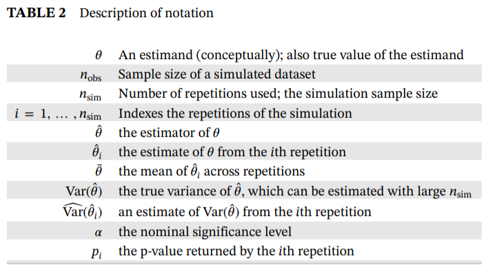
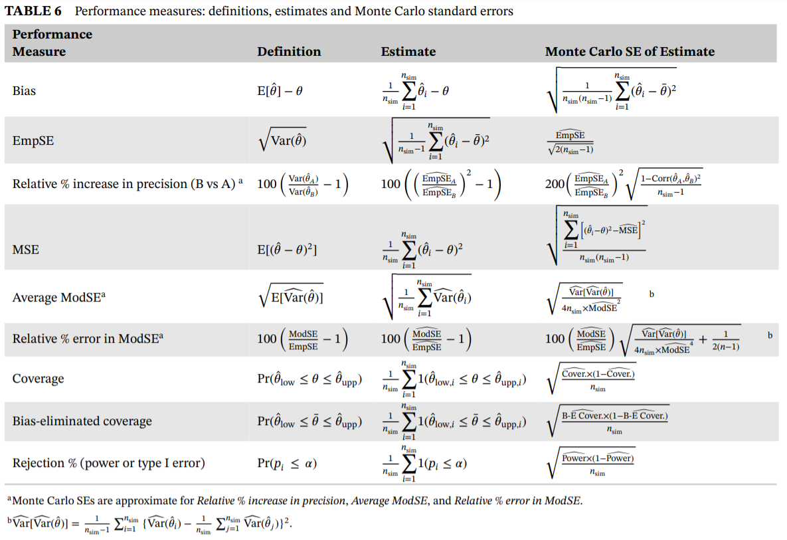

<!-- README.md is generated from README.Rmd. Please edit that file -->

```{r, include = FALSE}
knitr::opts_chunk$set(
  collapse = TRUE,
  comment = "#>",
  fig.path = "man/figures/README-",
  out.width = "100%"
)
```

# simMetric

<!-- badges: start -->
<!-- badges: end -->

`simMetric` is an R package that provides metrics (and their Monte Carlo standard errors) for the assessment of statistical methods in simulation studies.  This package includes metrics that are calculated as per this [tutorial](https://doi.org/10.1002/sim.8086) published by Tim Morris, Ian White and Michael Crowther. For an in-depth description on the calculation and interpretation, and how to perform a simulation study in general, refer to the tutorial.

## Installation

You can install the development version of simMetric from [GitHub](https://github.com/) with:

``` r
# install.packages("remotes")
remotes::install_github("RWParsons/simMetric")
```

Or install from CRAN

```
install.packages("simMetric")
```


## Included Metrics (taken from [here](https://doi.org/10.1002/sim.8086)).

#### Notation


#### Metrics



# Example

Here is a basic example that performs a simulation study, evaluates the metrics and plots the results:

```{r, message=FALSE, warning=FALSE}
library(simMetric)
library(tidyverse)
```


### define a function to generate some data and another that fits a linear model and returns some useful outputs.
### Here, we have two models that we want to compare. One of them includes an intercept term and the other doesn't.
```{r}
data_generator <- function(n_obs, noise=1, effect=0, s=42){
  set.seed(s)
  x <- rnorm(n=n_obs, mean=0, sd=1)
  y <- x*effect + rnorm(n=n_obs, mean=0, sd=noise)
  data.frame(x=x, y=y)
}

assess_lm <- function(data){
  model <- lm(y~x, data=data)
  model %>%
    broom::tidy(., conf.int=T) %>%
    filter(term=="x") %>%
    select(-any_of(c('term', 'statistic'))) %>%
    add_column(model="with_intercept")
}

assess_lm_no_intercept <- function(data){
  model <- lm(y~0+x, data=data)
  model %>%
    broom::tidy(., conf.int=T) %>%
    filter(term=="x") %>%
    select(-any_of(c('term', 'statistic'))) %>%
    add_column(model="without_intercept")
}

assess_lm(data_generator(n_obs=10, noise=0.1, effect=1))
assess_lm_no_intercept(data_generator(n_obs=10, noise=0.1, effect=1))
```

### define a grid of inputs to simulate many datasets
The number of unique `seed`s represents the number of simulations to be done (100 in this example)
```{r}
g <- expand.grid(
  seed=1:100,
  n_obs=seq(from=10, to=50, by=10),
  noise=0.1,
  effect=0.5
)
```

### define a function to take that grid and a (row) index, then generates the data and return the model outputs.
Since we want to simulate the multiple models, and we want to apply the same datasets to each set of models, we have one row returned per model that we are simulating.  This way, `fit_one_model` is run once per simulated dataset, and the generated data is used for all included models.
```{r}
fit_one_model <- function(grid, row){
  inputs <- grid[row, ]
  d <- data_generator(
    n_obs=inputs$n_obs, 
    noise=inputs$noise, 
    effect=inputs$effect, 
    s=inputs$seed
  )
  
  cbind(
    rbind(assess_lm(d),assess_lm_no_intercept(d)),
    inputs
  )
}
```


```{r}
fit_one_model(g, 1)
```


### run all simulations in parallel and collate all the results into a `data.frame`.
```{r}
library(parallel)
cl <- parallelly::autoStopCluster(makeCluster(detectCores()))
clusterExport(cl, ls()[!ls() %in% 'cl']) # send the grid and functions to each node
# x <- clusterEvalQ(cl, require(tidyverse, quietly=T)) # load the tidyverse on each node
x <- clusterEvalQ(cl, require(tidyverse, quietly=T)) # load the tidyverse on each node

start <- Sys.time()
ll <- parLapply(
  cl, 
  1:nrow(g),
  function(r) fit_one_model(grid=g, r)
)
par_res <- do.call("rbind", ll)

head(par_res)
```


## Obtaining metrics using `{simMetric}`
### Get metrics using `simMetric::join_metrics()`

```{r}
df_metrics <- join_metrics(
  par_res, id_cols=c("n_obs", "model"), 
  metrics=c("coverage", "mse", "modSE", "empSE", "relativeErrorModSE"),
  ll_col="conf.low",
  ul_col="conf.high",
  true_value="effect",
  estimates_col="estimate",
  se_col="std.error"
)

head(df_metrics)
```

### Get metrics within usual tidy workflow with `group_by()` and `summarise()`
```{r}
df_metrics <-
  par_res %>%
  group_by(n_obs, model) %>%
  summarise(
    coverage_estimate=coverage(true_value=effect, ll=conf.low, ul=conf.high, get="coverage"),
    coverage_mcse=coverage(true_value=effect, ll=conf.low, ul=conf.high, get="coverage_mcse"),
    mean_squared_error_estimate=mse(true_value=effect, estimates=estimate, get="mse"),
    mean_squared_error_mcse=mse(true_value=effect, estimates=estimate, get="mse_mcse")
  ) 
head(df_metrics)
```

### Plot the the Mean Squared Error (MSE) as the number of observations increases
The model estimates are closer to the truth (MSE is lower) as the sample used to fit the model increases in size.
The Monte Carlo standard error can easily be visualised to convey the uncertainty in these estimates.
The model without the intercept term seems to be a bit better, mostly when sample sizes are lower.

```{r}
df_metrics %>%
  ggplot(aes(as.factor(n_obs), mean_squared_error_estimate, group=model, colour=model)) +
  geom_point(position = position_dodge(width=0.2)) +
  geom_errorbar(aes(ymin=mean_squared_error_estimate-mean_squared_error_mcse, 
                    ymax=mean_squared_error_estimate+mean_squared_error_mcse),
                width=0, position = position_dodge(width=0.2)) +
  theme_bw() +
  labs(x="Number of observations", 
       y="Mean Squared Error\n",
       colour="Model",
       caption="\n(Error bars represent Monte Carlo standard error)") +
  scale_y_continuous(labels=scales::comma, limits=c(0, 0.0015))
```
