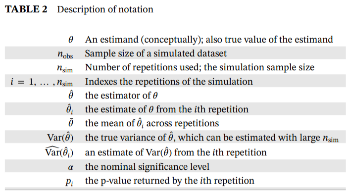
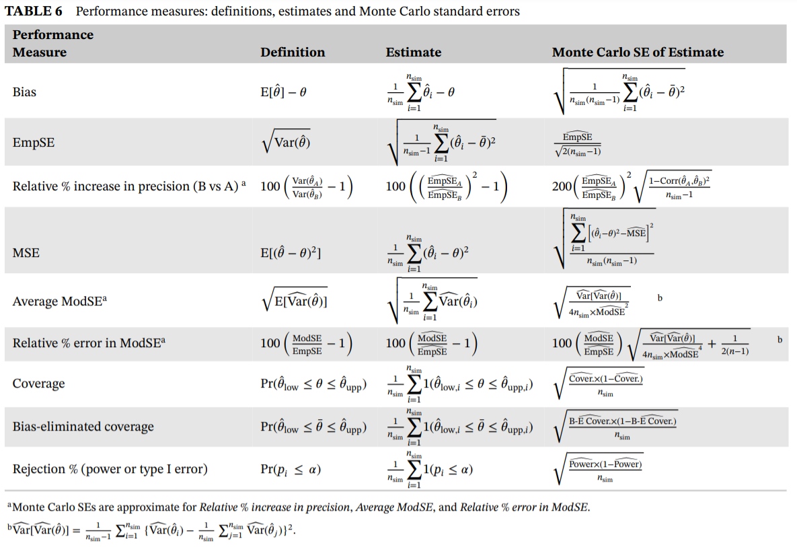
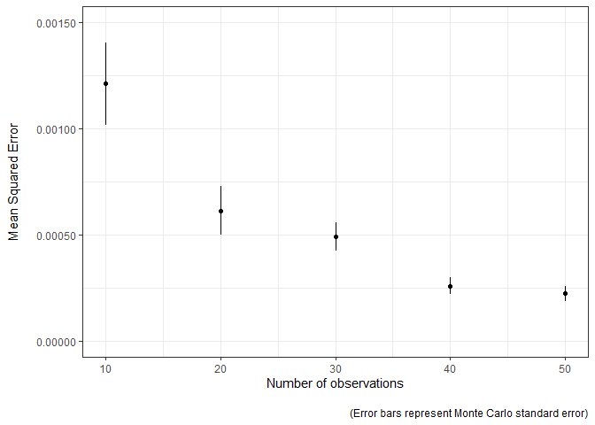

<!-- README.md is generated from README.Rmd. Please edit that file -->

# simMetric

<!-- badges: start -->
<!-- badges: end -->

`simMetric` is an R package that provides metrics (and their Monte Carlo
standard errors) for the assessment of statistical methods in simulation
studies. This package includes metrics that are calculated as per this
[tutorial](https://doi.org/10.1002/sim.8086) published by Tim Morris,
Ian White and Michael Crowther. For an in-depth description on the
calculation and interpretation, and how to perform a simulation study in
general, refer to the tutorial.

## Installation

You can install the development version of simMetric from
[GitHub](https://github.com/) with:

``` r
# install.packages("remotes")
remotes::install_github("RWParsons/simMetric")
```

Or install from CRAN

    install.packages("simMetric")

## Included Metrics (taken from [here](https://doi.org/10.1002/sim.8086)).

#### Notation



#### Metrics



# Example

Here is a basic example that performs a simulation study, evaluates the
metrics and plots the results:

``` r
library(simMetric)
library(tidyverse)
```

### define a function to generate some data and another that fits a linear model and returns some useful outputs.

``` r
data_generator <- function(n_obs, noise=1, effect=0, s=42){
  set.seed(s)
  x <- rnorm(n=n_obs, mean=0, sd=1)
  y <- x*effect + rnorm(n=n_obs, mean=0, sd=noise)
  return(data.frame(x=x, y=y))
}

assess_lm <- function(data){
  model <- lm(y~x, data=data)
  model %>%
    broom::tidy(., conf.int=T) %>%
    filter(term=="x") %>%
    select(-any_of(c('term', 'statistic')))
}

assess_lm(data_generator(n_obs=10, noise=0.1, effect=1))
#> # A tibble: 1 x 5
#>   estimate std.error     p.value conf.low conf.high
#>      <dbl>     <dbl>       <dbl>    <dbl>     <dbl>
#> 1    0.927    0.0640 0.000000504    0.779      1.07
```

### define a grid of inputs to simulate many datasets

### define a function to take that grid and a (row) index, then generate the data and return the model outputs.

``` r
fit_one_model <- function(grid, row){
  inputs <- grid[row, ]
  d <- data_generator(
    n_obs=inputs$n_obs, 
    noise=inputs$noise, 
    effect=inputs$effect, 
    s=inputs$seed
  )
  return(cbind(assess_lm(d),inputs))
}

g <- expand.grid(
  seed=1:100,
  n_obs=seq(from=10, to=50, by=10),
  noise=0.1,
  effect=0.5
)

fit_one_model(g, 1)
#>    estimate  std.error      p.value  conf.low conf.high seed n_obs noise effect
#> 1 0.4483862 0.04487337 8.537408e-06 0.3449081 0.5518644    1    10   0.1    0.5
```

### run all simulations in parallel and collate all the results into a `data.frame`.

``` r
library(parallel)
cl <- parallelly::autoStopCluster(makeCluster(detectCores()))
clusterExport(cl, ls()[!ls() %in% 'cl']) # send the grid and functions to each node
x <- clusterEvalQ(cl, require(tidyverse, quietly=T)) # load the tidyverse on each node

start <- Sys.time()
ll <- parLapply(
  cl, 
  1:nrow(g),
  function(r) fit_one_model(grid=g, r)
)
par_res <- do.call("rbind", ll)

head(par_res)
#>    estimate  std.error      p.value  conf.low conf.high seed n_obs noise effect
#> 1 0.4483862 0.04487337 8.537408e-06 0.3449081 0.5518644    1    10   0.1    0.5
#> 2 0.5239730 0.04153620 1.463669e-06 0.4281904 0.6197557    2    10   0.1    0.5
#> 3 0.4758010 0.02818650 1.537607e-07 0.4108028 0.5407992    3    10   0.1    0.5
#> 4 0.4733612 0.01069079 7.471135e-11 0.4487082 0.4980142    4    10   0.1    0.5
#> 5 0.4833071 0.03322526 4.888115e-07 0.4066895 0.5599247    5    10   0.1    0.5
#> 6 0.4404243 0.04231996 6.296868e-06 0.3428343 0.5380143    6    10   0.1    0.5
```

## Obtaining metrics using `{simMetric}`

### Get metrics using `simMetric::join_metrics()`

``` r
df_metrics <- join_metrics(
  par_res, id_cols=c("n_obs"), 
  metrics=c("coverage", "mse", "modSE", "empSE", "relativeErrorModSE"),
  ll_col="conf.low",
  ul_col="conf.high",
  true_value="effect",
  estimates_col="estimate",
  se_col="std.error"
)

head(df_metrics)
#> # A tibble: 5 x 11
#>   n_obs coverage coverage_mcse      mse  mse_mcse  modSE modSE_mcse  empSE
#>   <dbl>    <dbl>         <dbl>    <dbl>     <dbl>  <dbl>      <dbl>  <dbl>
#> 1    10     0.97        0.0171 0.00121  0.000193  0.0370   0.00155  0.0349
#> 2    20     0.94        0.0237 0.000613 0.000114  0.0248   0.000744 0.0249
#> 3    30     0.95        0.0218 0.000492 0.0000665 0.0193   0.000408 0.0223
#> 4    40     0.95        0.0218 0.000259 0.0000394 0.0163   0.000291 0.0161
#> 5    50     0.95        0.0218 0.000223 0.0000366 0.0144   0.000205 0.0150
#> # ... with 3 more variables: empSE_mcse <dbl>, relativeErrorModSE <dbl>,
#> #   relativeErrorModSE_mcse <dbl>
```

### Get metrics within usual tidy workflow with `group_by()` and `summarise()`

``` r
df_metrics <-
  par_res %>%
  group_by(n_obs) %>%
  summarise(
    coverage_estimate=coverage(true_value=effect, ll=conf.low, ul=conf.high, get="coverage"),
    coverage_mcse=coverage(true_value=effect, ll=conf.low, ul=conf.high, get="coverage_mcse"),
    mean_squared_error_estimate=mse(true_value=effect, estimates=estimate, get="mse"),
    mean_squared_error_mcse=mse(true_value=effect, estimates=estimate, get="mse_mcse")
  ) 
head(df_metrics)
#> # A tibble: 5 x 5
#>   n_obs coverage_estimate coverage_mcse mean_squared_error_e~ mean_squared_erro~
#>   <dbl>             <dbl>         <dbl>                 <dbl>              <dbl>
#> 1    10              0.97        0.0171              0.00121           0.000193 
#> 2    20              0.94        0.0237              0.000613          0.000114 
#> 3    30              0.95        0.0218              0.000492          0.0000665
#> 4    40              0.95        0.0218              0.000259          0.0000394
#> 5    50              0.95        0.0218              0.000223          0.0000366
```

### Plot the the Mean Squared Error (MSE) as the number of observations increases

The model estimates are closer to the truth (MSE is lower) as the sample
used to fit the model increases in size. The Monte Carlo standard error
can easily be visualised to convey the uncertainty in these estimates.

``` r
df_metrics %>%
  ggplot(aes(n_obs, mean_squared_error_estimate)) +
  geom_point() +
  geom_errorbar(aes(ymin=mean_squared_error_estimate-mean_squared_error_mcse, 
                    ymax=mean_squared_error_estimate+mean_squared_error_mcse),
                width=0) +
  theme_bw() +
  labs(x="Number of observations", 
       y="Mean Squared Error\n",
       caption="\n(Error bars represent Monte Carlo standard error)") +
  scale_y_continuous(labels=scales::comma, limits=c(0, 0.0015))
```


